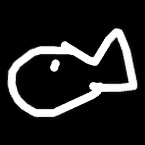

<table>
  <tr>
    <td width="200" align="center" valign="top" style="border: none;">
      
      

        
          <b>How I generated this:</b> a
          <a href="https://github.com/googlecreativelab/quickdraw-dataset">Quick, Draw!</a>
          fish, zoomed a hundred doublings. Redrawn at every step, never enlarged. From
          <a href="https://github.com/enazari/Trio-Diffusion">Trio-Diffusion</a>.
        
      

    </td>
    <td valign="top" style="border: none;">

<strong>Ehsan Nazari</strong>

ML Researcher & CV Engineer at [Pacefactory](https://www.pacefactory.com) · MSc in Applied AI, University of Ottawa

Fascinated by how deep networks understand the visual world: how they represent, generate, and reason about what they see. On my own time I explore this, from autoregressive image generation ([Trio-Diffusion](https://github.com/enazari/Trio-Diffusion)) to probing face verification representations ([ArcFace-vs-InfoNCE](https://github.com/enazari/ArcFace-vs-InfoNCE)), and more. See pinned projects.

[Website](https://enazari.github.io) · [LinkedIn](https://www.linkedin.com/in/nazari-ehsan) · [Google Scholar](https://scholar.google.com/citations?user=5T9AfA0AAAAJ)

Implementation in recent projects was accelerated with AI pair-programming. I lead architecture and validation.

</td>
  </tr>
</table>
